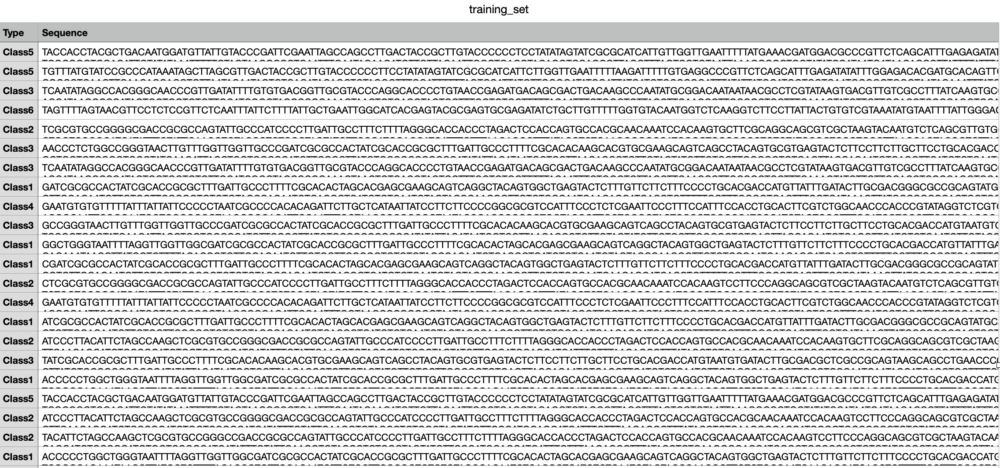

# Introduction

a simple virus DNA classification in bioinformatic to classify some virus with their DNA.
data is sequence of nucleic acids with their label.
I have used word-embedding and fully-connected neural network model for this purpose


#### Example of Data


# Install

```bash
sudo apt install python3 python3-pip python3-venv


# create venv
python3 -m venv venv
source  venv/bin/activate
python3 -U pip install -U pip
python3 -m pip install -r requirements.txt
```

# Run

```bash
# Add this venv to jupyter
python3 -m ipykernel install --user --name bio-venv
# Start Jupyter-notebook server
jupyter-notebook .

```